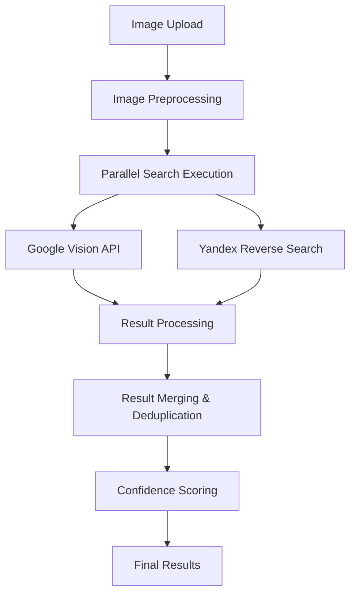

# Design Document

## Overview

This design document outlines the integration of Yandex reverse image search capabilities into the existing image leak detection system. The integration will enhance search accuracy and coverage by adding Yandex's powerful image search engine alongside the current Google Vision API implementation.

The system currently uses Google Vision API for web detection, label detection, object localization, and text detection. This design adds Yandex's reverse image search as a complementary search engine, with intelligent result merging and fallback mechanisms.

## Architecture

### High-Level Architecture



### Search Engine Integration Pattern

The system will implement a multi-engine search pattern where:

1. **Parallel Execution**: Both Google Vision API and Yandex searches run concurrently
2. **Independent Fallback**: If one engine fails, the other continues
3. **Result Aggregation**: Results from both engines are merged intelligently
4. **Source Attribution**: Each result maintains metadata about its source engine

### Configuration Management

Environment variables will control the integration:
- `YANDEX_API_KEY`: Yandex API authentication key
- `YANDEX_SEARCH_TIMEOUT`: Timeout for Yandex API calls (default: 15 seconds)
- `YANDEX_ENABLED`: Boolean flag to enable/disable Yandex integration
- `PARALLEL_SEARCH_ENABLED`: Enable parallel execution of search engines

## Components and Interfaces

### 1. Yandex Search Client

**Purpose**: Handle all interactions with Yandex reverse image search API

**Interface**:
```python
class YandexImageSearchClient:
    def __init__(self, api_key: str, timeout: int = 15)
    async def reverse_image_search(self, image_content: bytes) -> List[YandexSearchResult]
    def validate_credentials(self) -> bool
    def is_available(self) -> bool
```

**Key Methods**:
- `reverse_image_search()`: Performs the actual reverse image search
- `validate_credentials()`: Checks if API key is valid
- `is_available()`: Checks if service is currently accessible

### 2. Search Engine Manager

**Purpose**: Orchestrate multiple search engines and manage parallel execution

**Interface**:
```python
class SearchEngineManager:
    def __init__(self, google_client, yandex_client)
    async def search_all_engines(self, image_content: bytes) -> SearchResults
    def get_available_engines(self) -> List[str]
    async def search_with_fallback(self, image_content: bytes) -> SearchResults
```

**Key Methods**:
- `search_all_engines()`: Execute searches on all available engines in parallel
- `search_with_fallback()`: Execute with graceful fallback if engines fail
- `get_available_engines()`: Return list of currently available search engines

### 3. Result Merger

**Purpose**: Intelligently merge and deduplicate results from multiple search engines

**Interface**:
```python
class SearchResultMerger:
    def merge_results(self, google_results: List[dict], yandex_results: List[dict]) -> List[dict]
    def deduplicate_urls(self, results: List[dict]) -> List[dict]
    def calculate_combined_confidence(self, url: str, results: List[dict]) -> float
```

**Key Methods**:
- `merge_results()`: Combine results from different engines
- `deduplicate_urls()`: Remove duplicate URLs while preserving best metadata
- `calculate_combined_confidence()`: Compute confidence scores when URL found by multiple engines

### 4. Enhanced Search Function

**Purpose**: Replace the existing `search_web_for_image()` function with multi-engine support

**Interface**:
```python
async def search_web_for_image_enhanced(image_content: bytes) -> List[dict]:
    """
    Enhanced image search using multiple engines (Google Vision API + Yandex)
    Returns merged and deduplicated results with source attribution
    """
```

## Data Models

### YandexSearchResult

```python
@dataclass
class YandexSearchResult:
    url: str
    title: str
    description: str
    confidence_score: float
    image_url: str
    source_domain: str
    search_method: str = "Yandex Reverse Search"
    timestamp: datetime
```

### EnhancedSearchResult

```python
@dataclass
class EnhancedSearchResult:
    url: str
    title: str
    description: str
    confidence_score: float
    search_engines: List[str]  # ["Google", "Yandex"] or subset
    search_method: str
    source_attribution: dict  # Engine-specific metadata
    is_cross_validated: bool  # Found by multiple engines
    timestamp: datetime
```

### SearchEngineStats

```python
@dataclass
class SearchEngineStats:
    google_results: int
    yandex_results: int
    unique_to_google: int
    unique_to_yandex: int
    cross_validated: int
    total_unique: int
    search_time_google: float
    search_time_yandex: float
    total_search_time: float
```

## Error Handling

### Error Categories

1. **Authentication Errors**
   - Invalid API keys
   - Expired credentials
   - Insufficient permissions

2. **Network Errors**
   - Connection timeouts
   - DNS resolution failures
   - HTTP errors (4xx, 5xx)

3. **Rate Limiting**
   - API quota exceeded
   - Too many requests per second
   - Daily/monthly limits reached

4. **Data Errors**
   - Invalid image format
   - Image too large/small
   - Corrupted image data

### Error Handling Strategy

```python
class SearchEngineError(Exception):
    def __init__(self, engine: str, error_type: str, message: str, recoverable: bool = True)

class ErrorHandler:
    def handle_yandex_error(self, error: Exception) -> SearchEngineError
    def should_retry(self, error: SearchEngineError) -> bool
    def get_retry_delay(self, attempt: int) -> float
    async def execute_with_retry(self, func, max_retries: int = 3) -> Any
```

### Fallback Mechanisms

1. **Engine Unavailable**: Continue with available engines
2. **Partial Failure**: Return results from successful engines
3. **Complete Failure**: Return empty results with error logging
4. **Timeout Handling**: Cancel slow requests and proceed with completed ones

## Testing Strategy

### Unit Tests

1. **Yandex Client Tests**
   - API authentication validation
   - Image upload and search functionality
   - Error handling for various failure scenarios
   - Response parsing and data transformation

2. **Search Engine Manager Tests**
   - Parallel execution coordination
   - Fallback mechanism validation
   - Engine availability detection
   - Timeout handling

3. **Result Merger Tests**
   - URL deduplication logic
   - Confidence score calculation
   - Cross-validation detection
   - Metadata preservation

### Integration Tests

1. **End-to-End Search Tests**
   - Complete search workflow with both engines
   - Result quality and accuracy validation
   - Performance benchmarking
   - Error recovery testing

2. **API Integration Tests**
   - Real Yandex API calls with test images
   - Rate limiting behavior
   - Authentication edge cases
   - Network failure simulation

### Performance Tests

1. **Load Testing**
   - Concurrent search requests
   - Memory usage under load
   - Response time distribution
   - Resource cleanup validation

2. **Benchmark Tests**
   - Search accuracy comparison (before/after Yandex)
   - Performance impact measurement
   - Coverage improvement quantification
   - False positive rate analysis

### Test Data Strategy

1. **Test Image Set**
   - Known images with expected results
   - Various image formats and sizes
   - Images with different complexity levels
   - Edge cases (very small, very large, corrupted)

2. **Mock Responses**
   - Yandex API response samples
   - Error response scenarios
   - Rate limiting responses
   - Network timeout simulations

## Implementation Phases

### Phase 1: Core Yandex Integration
- Implement YandexImageSearchClient
- Add basic reverse image search functionality
- Implement authentication and error handling
- Add configuration management

### Phase 2: Parallel Search Architecture
- Implement SearchEngineManager
- Add parallel execution support
- Implement fallback mechanisms
- Add comprehensive logging

### Phase 3: Result Enhancement
- Implement SearchResultMerger
- Add intelligent deduplication
- Implement cross-validation logic
- Add enhanced confidence scoring

### Phase 4: Integration and Optimization
- Replace existing search function
- Add performance monitoring
- Implement caching strategies
- Add comprehensive testing

## Security Considerations

1. **API Key Management**
   - Store keys in environment variables only
   - Never log API keys or sensitive data
   - Implement key rotation support
   - Validate key format and permissions

2. **Data Privacy**
   - Ensure uploaded images are not stored by Yandex
   - Implement secure image transmission
   - Add data retention policies
   - Comply with privacy regulations

3. **Rate Limiting Protection**
   - Implement client-side rate limiting
   - Add exponential backoff
   - Monitor API usage patterns
   - Implement circuit breaker pattern

## Monitoring and Observability

1. **Metrics Collection**
   - Search success/failure rates per engine
   - Response times and performance metrics
   - API quota usage tracking
   - Result quality metrics

2. **Logging Strategy**
   - Structured logging with correlation IDs
   - Error categorization and alerting
   - Performance monitoring
   - Usage pattern analysis

3. **Health Checks**
   - Engine availability monitoring
   - API credential validation
   - Performance threshold monitoring
   - Automated failover triggers